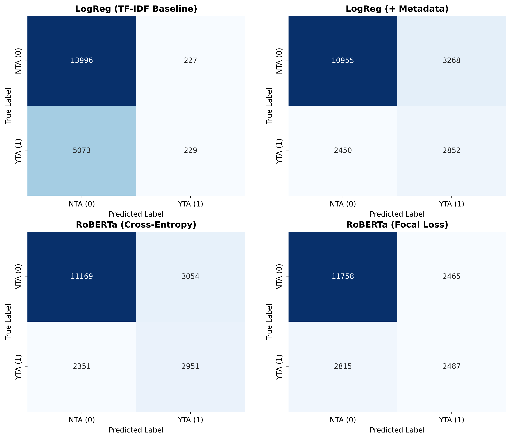
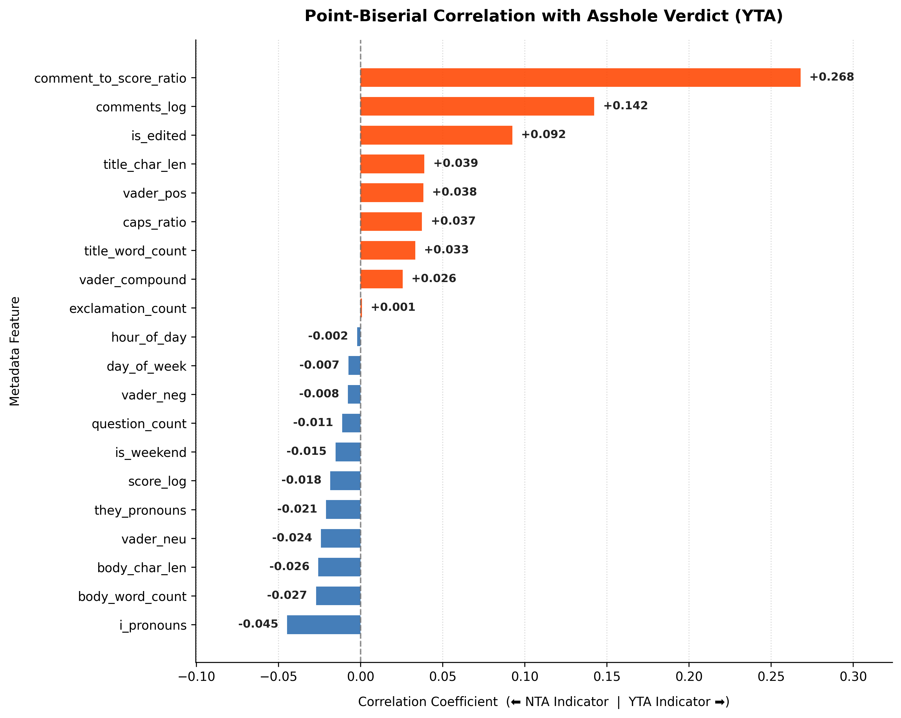
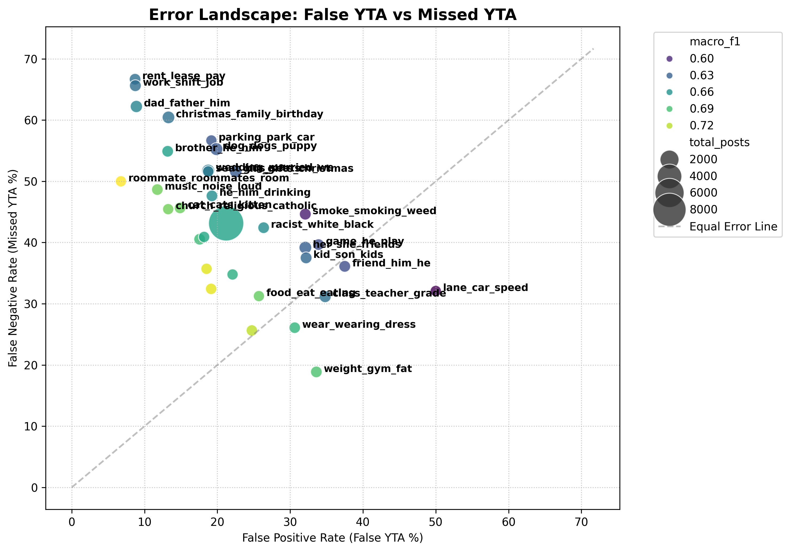

r/AITA Post Classifier & Web App Live Application Demo: 
[https://aita-classifier-marvin-xxxx.a.run.app](https://aita-classifier-482267030164.us-central1.run.app/)

An end-to-end Machine Learning microservice that classifies Reddit "Am I The Asshole?" (r/AITA) posts into YTA (Asshole) or NTA (Not The Asshole) verdicts using a fine-tuned Transformer model, served via a containerized FastAPI application on GCP Cloud Run.


## Abstract

Redditors are frequently described as a "hive-mind". That is, a group whose collective consensus is so uniform it ought to be trivially predictable. What began as an attempt to prove or disprove this idea quickly turned into an analysis of the friction between natural language processing and human social dynamics.

As it turns out, evaluating whether someone is "the asshole" isn't a simple classification problem. Social media text is notoriously noisy, grammatically inconsistent, and steeped in sarcasm. More importantly, r/AITA posts represent a chaotic web of unwritten social contracts, family feuds, and financial boundaries. This project documents the journey of fine-tuning, evaluating, and deploying a Transformer model to parse these messy, deeply human stories.

## Executive Summary:

This project implements a production-grade NLP pipeline: 

1. **Fine-Tuned Transformer:** Fine-tuned RoBERTa on preprocessed r/AITA post submissions.
2. **Decision Threshold Calibration:** Evaluated decision boundaries across precision-recall trade-offs, confirming that the standard calibrated threshold $\tau = 0.50$ maximizes the $F_1$-score on validation data.
3. **Containerized Microservice:** Built using FastAPI and Docker, hardened for production, cached model weights for instant boot, and deployed to GCP Cloud Run.

## Model Selection & Feature Analysis

> **Deep Dive Notebook:** For full confusion matrices, scatter plots, and topic-level error distributions, see [`02_error+feature_analysis.ipynb`](./notebooks/02_error+feature_analysis.ipynb).

To evaluate the predictive signal across post text, social context, and user behavior, four model iterations were trained and compared:

1. **Baseline Logistic Regression (TF-IDF):** Trained strictly on unigram/bigram TF-IDF vectors.
2. **Enhanced Logistic Regression (TF-IDF + Metadata):** Augmented TF-IDF features with post engagement and structural metadata.
3. **RoBERTa (Cross-Entropy Loss):** Fine-tuned end-to-end on preprocessed text.
4. **RoBERTa (Focal Loss):** Fine-tuned with focal loss to address class imbalance.

---

### Performance Iteration & Model Progression



| Model | Input Features | Macro $F_1$ | Key Takeaway |
| :--- | :--- | :--- | :--- |
| **Baseline Logistic Regression** | TF-IDF Text Vectors | ~0.46 | Collapses to majority class (`NTA`) due to feature sparsity. |
| **Enhanced Logistic Regression** | TF-IDF + Metadata | **0.65** | Massive jump (+0.19 $F_1$), proving behavioral metadata contains strong predictive signal. |
| **RoBERTa (Cross-Entropy)** | Raw Post Text | **0.71+** | Outperforms feature engineering by capturing context, tone, and implicit social norms. |
| **RoBERTa (Focal Loss)** | Raw Post Text | ~0.71 | Performs comparably to Cross-Entropy; pre-training representations dominate loss variant. |

---

### Behavioral & Metadata Signals



Inspecting feature coefficients and univariate correlations in the enhanced Logistic Regression model revealed strong social patterns driving community judgment:

* **The "Ratio" Effect ($\text{Correlation} = +0.268$):** A post's comment-to-score ratio is the single strongest univariate predictor of `YTA`. High comment counts paired with low upvote scores reflect community outrage ("getting ratioed"). The Logistic Regression model effectively reconstructed this signal via raw `comment_count` ($+$ weight) and `score` ($-$ weight).
* **The "Edit" Red Flag:** Posts flagged as `edited` strongly predict `YTA`. Authors frequently return to the thread to backtrack, defend their actions, or offer defensive post-hoc explanations.
* **First-Person Accountability:** High usage of "I" pronouns correlates with `NTA`. First-person narrative styles often reflect accountability or detailed self-explanation, which garners community sympathy.
* **Title Structure & Length:** Longer titles (in total characters and average word length) push predictions toward `YTA`. Wordy, over-explained titles often signal defensiveness before the story even begins.

---

### Lexical Features & Social Psychology Insights

A statistical analysis (Chi-Squared test) showed that raw text features are extremely sparse—only **11 words** met strict statistical significance thresholds. This explains why the raw TF-IDF baseline failed and defaulted to predicting `NTA`.

However, analyzing the top positive (YTA) and negative (NTA) coefficients yields several qualitative findings:

#### 1. The "Thought Crime" Phenomenon
Phrases like *"AITA for wanting..."* are strong predictors of **NTA**. Reddit communities distinguish heavily between intent and execution: expressing a selfish desire or feeling in abstract (*"wanting to quit my brother's wedding"*) is judged leniently compared to committing the actual act.

#### 2. Familial Bias vs. Partner Friction
* **Nuclear Family (`NTA`):** Mentions of *"mom"*, *"family"*, and *"brother"* heavily incline the community toward `NTA`. Voters display systemic empathy regarding family dynamics, often siding with posters against "toxic parents" or "annoying siblings."
* **Partners & Close Friends (`YTA`):** Mentions of *"gf"*, *"wife"*, or *"close friends"* shift predictions toward `YTA`. Audiences hold posters to higher standards of respect toward partners and close peers compared to extended family.

#### 3. Defensive Framing vs. Remorse
* **YTA Predictors:** Hedging vocabulary (*"anyways"*, *"guess"*, *"didnt want"*, *"reasonable"*) and aggressive verbs (*"throw"*) strongly associate with assholery.
* **NTA Predictors:** Words signaling remorse (*"upset"*, *"horrible"*) and concrete situational stressors (*"rent"*, *"gas"*, *"business"*) lead to acquittal, as the community recognizes external pressure.

## Error Analysis & Qualitative Insights

To evaluate model performance beyond aggregate metrics, I analyzed prediction failures across post length, topic clusters, and narrative structure. A clear pattern emerged: **text truncation drives systematic prediction bias**, while the model struggles with unwritten social contracts and emotional valence.

---

### 1. Text Length & Truncation Bias

Because long posts were truncated to fit the context window by retaining only the head and tail of the text, length played a major role in model errors:

```text
Post Length <= 150 words   ──►   "Trigger-Happy" (High FPR: 25.44%) ──► Over-predicts YTA
Post Length > 450 words    ──►   "Hesitant"      (High FNR: 49.77%) ──► Over-predicts NTA
```

- **Short Posts ($\le 150$ words):** Deprived of crucial nuance, the model becomes overly punitive. Lacking context, it reacts to isolated aggressive keywords, yielding a high False Positive Rate ($\text{FPR} = 25.44\%$), falsely accusing posters of being the asshole.
- **Long Posts ($> 450$ words):** Truncation severely degrades recall. The model defaults to the majority class (NTA), resulting in a massive False Negative Rate ($\text{FNR} = 49.77\%$), missing nearly half of all actual assholes. Furthermore, user edits, self-corrections, and "TL;DR" summaries at the end of long posts distort the model's temporal understanding of the story.

### 2. Topic Level Error Distributions
Grouping errors by topic clusters (constructed using Bertopic) reveals two distinct failure modes based on error bias ($\text{FNR} - \text{FPR}$):



- Hesitant Topics (High False Negatives / Type 2 Errors)
**Topics:** rent_lease_pay, work_shift_job, parking_park_car, roommates_roommate_room, dad_father_him, brother_he_him, christmas_family_birthday

**Behavior:** The model frequently misses true assholes when posters justify their behavior using explicit rules, corporate policies, or legal rights (e.g., calling the police over a parking violation). While technically "within their rights," these actions often break unspoken social contracts. Additionally, drawn-out familial or roommate disputes make it difficult for the model to weigh retaliation versus self-defense.

-  "Trigger-Happy" Topics (High False Positives / Type 1 Errors)
**Topics:** weight_gym_fat, wear_wearing_dress, lane_car_speed.

**Behavior:** The model over-predicts YTA on short, emotionally charged posts containing high-valence trigger words (e.g., "fat", "screamed", "yelled", "inappropriate"). The model anchors heavily on the emotional tone rather than evaluating whether the reaction was justified in context.

### 3. Core Model Blindspots
1. **Intention vs. Impact:** The model struggles to separate a poster's benign intent from a harmful outcome. For instance, accidental harm caused while trying to join in on a joke is often misclassified because the model cannot weigh good intentions against negative results.
2. **Legal Rights vs. Unwritten Social Nuance:** The model favors written rules (e.g., employment contracts, parking enforcement) over implicit cultural consensus (e.g., workplace boundaries, destination wedding etiquette, driving courtesy).
3. **Gender & Topic Dynamics:** Topics centered around body image, clothing, or specific family dynamics (dad, brother) exhibit disproportionate error rates, pointing to potential domain-specific biases within the pre-trained weights or fine-tuning dataset.

## System Architecture

```text
[ Reddit Post Input ] 
         │
         ▼
 ┌─────────────────────────────────────────────────────────┐
 │ FastAPI App Container (GCP Cloud Run)                    │
 │  ├── Preprocessing (clean_and_format)                   │
 │  ├── Inference (RoBERTa PyTorch Model @ cache)          │
 │  └── Threshold Logic (YTA if P(Asshole) >= 0.50)        │
 └─────────────────────────────────────────────────────────┘
         │
         ▼
[ Reddit-Themed UI / JSON Prediction Response ]
```

## Tech Stack:
- Machine Learning & Modeling: PyTorch, Hugging Face Transformers, Scikit-learn, Pandas
- API & Backend: FastAPI, Uvicorn, Pydantic
- DevOps & Cloud: Docker, Google Cloud Platform (Cloud Run, Cloud Build, Artifact Registry)

## Repository Structure

```text

aita_classifier/
├── .dockerignore            # Docker context exclusions
├── Dockerfile               # Production multi-stage Docker build
├── requirements.txt         # Lightweight production dependencies
├── requirements-dev.txt     # Local development & evaluation dependencies
├── README.md                # Project documentation
├── helpers.py
├── lookup.py
├── assets/                  # Images and visualizations for documentation
│   └── confusion_matrix.png
├── app/
│   ├── __init__.py          # Package marker
│   └── main.py              # FastAPI server, health endpoint & Reddit UI
├── notebooks/
│   └── 02_error_analysis.ipynb  # Error analysis & validation visualizations
└── src/
    └── train_modernbert.py  # Model training pipeline code
```

## Local Development Setup
1. Clone & Install Dependencies:

```Bash
git clone https://github.com/YOUR_USERNAME/r-AITA_classifier.git
cd r-AITA_classifier

# Create local environment
python3 -m venv .venv
source .venv/bin/activate  # On Windows: .venv\Scripts\activate

# Install development packages
pip install -r requirements-dev.txt
```

2. Run Application Locally:

```Bash
uvicorn app.main:app --reload --port 8000
```
Open http://localhost:8000 in your browser to interact with the web interface.

## Docker Deployment
1. Build and Test Container Locally:
```Bash
docker build -t aita-classifier .
docker run -p 8000:8000 aita-classifier
```

2. Deploy to Google Cloud Run
```Bash
gcloud run deploy aita-classifier \
  --source . \
  --region us-central1 \
  --memory 2Gi \
  --port 8000 \
  --allow-unauthenticated
```
